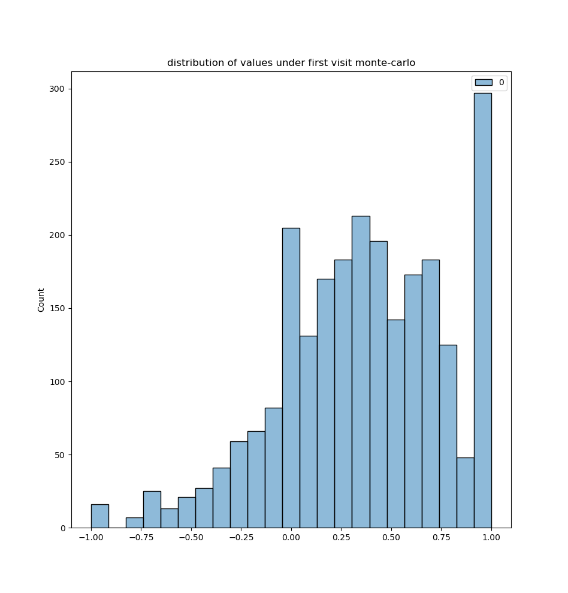
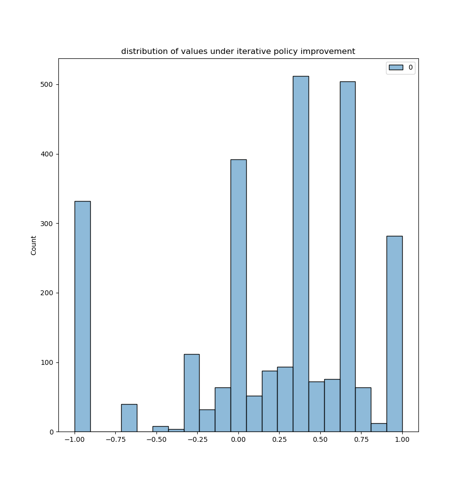

# ECE-6930-004 - Program 1: Tic-Tac-Toe

This project features a policy evaluation for a uniformly random agent using first-visit monte carlo evaluation alongside iterative policy evaluation to estimate the value function. Additionally, a one-step policy improvement is implemented to achieve better actions when compared to the random agent.



    fig 1: Distribution of values for monte carlo policy evaluation



    fig 1: Distribution of values for iterative policy evaluation


## Details on Iterative policy evaluation

**Tolerance Used**: `1e-4`

**Example Values Obtained**:

```
"(' ', ' ', ' ', ' ', 'O', ' ', 'X', ' ', ' ')",0.1142857142857143
"(' ', 'O', ' ', ' ', 'X', 'O', ' ', 'X', ' ')",0.4666666666666667
"(' ', 'O', 'O', 'X', 'O', 'X', 'X', 'O', 'X')",-1.0
"(' ', ' ', 'X', 'O', ' ', 'X', ' ', 'O', ' ')",0.7333333333333334
"(' ', 'X', 'O', 'X', ' ', 'O', 'O', ' ', 'X')",0.3333333333333333
"('O', 'X', ' ', 'X', 'O', 'O', 'O', 'X', 'X')",0.0
```

*The full value table can found in `value-table.csv`*

## Running the Program

Ensure you have the following modules in your python environment
- numpy
- tqdm
- seaborn
- matplotlib

These can be installed with `pip` if not already present

```bash
$ python -m pip install numpy tqdm seaborn matplotlib
```

If you are on `Arch Linux`, you will need to use `pacman` to install these packages instead of `pip`:

```
# pacman -S python-numpy python-tqdm python-seaborn python-matplotlib
```

Consider using a virtual environment in this scenario to keep your base python install in a default state

```bash
$ cd [project directory] 
$ python -m venv [venv-name]
$ source [venv-name]/bin/activate
$ python -m pip install numpy tqdm seaborn matplotlib
```

From here, the program can be ran with no arguments

```
python tictactoe.py
```
